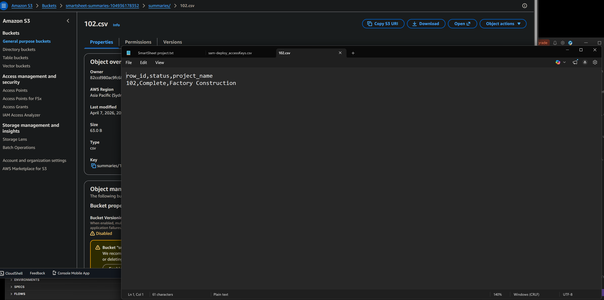

# Smartsheet Webhook Pipeline


A Python AWS Lambda pipeline that processes row data and stores it in DynamoDB. When a row status is "Complete", it exports a CSV summary to S3.

[Watch the Demo Video](https://www.youtube.com/watch?v=oYZsltt8m-Y) · [Architecture](#architecture)


## Demo

The video shows the webhook being triggered and the row written to DynamoDB. When the row status is "Complete", Lambda also exports a CSV to S3. 

The screenshot below shows the exported file:




## Table of Contents

- [What This Does](#what-this-does)
- [Tech Stack](#tech-stack)
- [Highlights](#highlights)
- [Architecture](#architecture)
- [Getting Started](#getting-started)
- [Local Testing](#local-testing)
- [What's Built](#whats-built)
- [In Progress](#in-progress)


## What This Does

Demonstrates the core integration pattern used by Smartsheet solution partners.

A POST request arrives with row data. Lambda validates and processes the payload. The row is written to DynamoDB. If the row status is "Complete", Lambda also exports a CSV summary to S3.

- Validates incoming JSON payload
- Writes every row to DynamoDB
- Exports completed rows to S3 as CSV


## Tech Stack

- Python 3.12
- AWS Lambda
- AWS API Gateway
- AWS DynamoDB
- AWS S3
- AWS SAM (deployment)


## Highlights

AWS CLI:
```
Used the AWS CLI to configure credentials and interact with AWS services from the terminal, without needing the AWS console.
```

AWS SAM (Serverless Application Model):
```
SAM sits on top of CloudFormation and provides shorter, simpler syntax for defining serverless resources like Lambda functions, API Gateway, and DynamoDB tables. This reduces the amount of YAML needed and makes deployments faster to set up and repeat.
```

DynamoDB on-demand billing:
```
Set `BillingMode: PAY_PER_REQUEST` on the DynamoDB table. This means you are only charged per read or write operation, with no minimum cost. It is a better fit for low-traffic or experimental projects where usage is unpredictable.
```

## Architecture

```
POST request API Endpoint
e.g. `https://<id>.execute-api.<region>.amazonaws.com/prod/webhook`
      |
      ▼
 API Gateway
      |
      ▼
   Lambda
      |
      ▼
  DynamoDB
      |  (if status = "Complete")
      ▼
     S3   (CSV export)
```


## Getting Started

1. Clone the repo
2. Install AWS SAM CLI and run `aws configure`
3. Run `sam build`
4. Run `sam local invoke` to test locally
5. Run `sam deploy --guided` to deploy to AWS


## Local Testing

The test event, `test_event.json`, is a simplified payload, not a real Smartsheet webhook shape:
```
{
  "body": "{\"row_id\": \"101\", \"status\": \"In Progress\", \"project_name\": \"Bridge Construction\"}",
  "httpMethod": "POST",
  "headers": {
    "Content-Type": "application/json"
  }
}
```
For the real Smartsheet webhook payload, see the Smartsheet webhook docs.


## What's Built

- SAM project with `template.yaml` and `lambda_function.py`
- API Gateway POST endpoint
- Lambda validates and processes incoming row data
- DynamoDB table defined in SAM template, written to via boto3
- S3 export triggered when `status == "Complete"`
- CI/CD with GitHub Actions


## In Progress

- ~~Real Smartsheet webhook signature verification~~ (need a paid account)
- Unit tests
- Structured logging to CloudWatch (for logs errors and events)